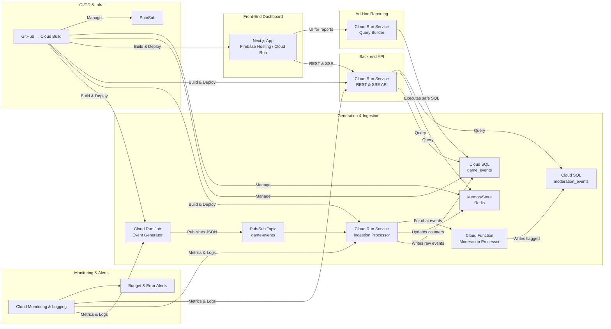

# Game Ops Dashboard

**GCP-native internal admin dashboard for live game operations**
Simulates millions of game events/day via Pub/Sub → Cloud Run → Cloud SQL & MemoryStore → Next.js UI.

---

## 🎉 Milestone: Generator Service Completed

We've built and containerized the **Event Generator** service, which:

* Simulates game events (login, match\_start, match\_end, chat, purchase, error) with weighted probabilities.
* Publishes JSON events to a Pub/Sub topic (`game-events`) at a configurable rate (`EVENT_INTERVAL_MS`).
* Implements exponential back-off and graceful shutdown (SIGINT/SIGTERM).
* Proven locally via Node.js and in Docker:

  * Simplified `docker run --env-file .env -v ~/.gcp:/root/.gcp:ro game-ops-generator`
  * Verified mount and credentials loading inside container.


---

## Architecture

Below is the high-level system diagram. To view it, either:

- Open `diagrams/architecture.mmd` in VS Code with the “Mermaid Preview” extension  
- Paste the contents into [Mermaid Live Editor](https://mermaid.live)


---

## 🛠 Getting Started (Local)

### Prerequisites

* Node.js v18+
* Docker Desktop (daemon running)
* A GCP project with Pub/Sub enabled and a service account key at `~/.gcp/game-ops-demo-sa.json`

### 1. Clone the Repo

```bash
gh repo clone your-org/game-ops-dashboard
cd game-ops-dashboard
```

### 2. Environment

1. Copy & fill the template:

   ```bash
   cp .env.example .env
   ```
2. In `.env`, set:

   ```ini
   PROJECT_ID=your-gcp-project-id
   PUBSUB_TOPIC=game-events
   GOOGLE_APPLICATION_CREDENTIALS=/root/.gcp/game-ops-demo/game-ops-demo-sa.json
   EVENT_INTERVAL_MS=100
   ```

### 3. Run Generator Locally

```bash
cd services/generator
npm install
node index.js
```

You should see logs:

```
Published login (...)
Published chat (...)
...
```

Press Ctrl+C to stop (graceful shutdown).

### 4. Dockerize Generator

```bash
cd services/generator
docker build -t game-ops-generator .
docker run --rm \
  --env-file ../../.env \
  -v C:/Users/xxxx/.gcp:/root/.gcp:ro \
  game-ops-generator
```

Check logs, then Ctrl+C to exit.

---

## ✨ Next Steps

1. **Ingestion Processor**: subscribe to `game-events-sub`, write into Cloud SQL.
2. Containerize ingestion service and deploy both services to Cloud Run.
3. Develop Next.js dashboard and API service.
4. Automate infra provisioning with Terraform & Cloud Build.

---

## ⚡ Credits
* Built with ❤️ by Tiffany Gill