# Game Ops Dashboard

**GCP-native internal admin dashboard for live game operations**
Simulates millions of game events/day via Pub/Sub → Cloud Run → Cloud SQL & MemoryStore → Next.js UI.

---

## 🎉 Milestones Completed

### 1. Event Generator Service

* Simulates weighted game events (login, match\_start, match\_end, chat, purchase, error).
* Publishes JSON to Pub/Sub topic (`game-events`) at configurable rate (`EVENT_INTERVAL_MS`).
* Implements exponential back-off and graceful shutdown (SIGINT/SIGTERM).
* Verified locally via Node.js and in Docker.

### 2. Ingestion Processor Service

* Subscribes to Pub/Sub subscription (`game-events-sub`).
* Parses incoming JSON events.
* Writes each event into Cloud SQL (`game_events` table).
* Containerized and tested end-to-end using Docker network and Cloud SQL Proxy.

---

## Architecture

Open `diagrams/architecture.mmd` in VS Code (Mermaid Preview) or at [Mermaid Live Editor](https://mermaid.live).

```mermaid
flowchart LR
  subgraph Generation & Ingestion
    A[Event Generator<br>Cloud Run Job] 
    A -->|Publishes JSON| B[Pub/Sub Topic<br>game-events]
    B --> C[Ingestion Processor<br>Cloud Run Service]
    C -->|Writes raw events| D[Cloud SQL<br>game_events]
  end
  subgraph Front-End & API
    H[REST & SSE API<br>Cloud Run] --> D
    H --> E[MemoryStore<br>Redis]
    I[Next.js Dashboard] --> H
  end
  subgraph CI/CD & Infra
    K[GitHub → Cloud Build] --> A & C & H & I
  end
```



---

## 🛠 Getting Started (Local)

### Prerequisites

* Node.js v18+
* Docker Desktop (daemon running)
* GCP project with Pub/Sub & Cloud SQL enabled
* Service account key JSON at your local path (e.g. `~/.gcp/game-ops-demo-sa.json` or `C:/Users/xxxx/.gcp/game-ops-demo-sa.json`)

### 1. Clone the Repository

```bash
gh repo clone your-org/game-ops-dashboard
cd game-ops-dashboard
```

### 2. Environment Variables

1. Copy the example:

   ```bash
   cp .env.example .env
   ```
2. Open `.env` and fill in:

   ```dotenv
   PROJECT_ID=your-gcp-project-id
   REGION=us-central1
   # Use /root/.gcp/... in Docker, or your local full path for Node.js
   GOOGLE_APPLICATION_CREDENTIALS=/root/.gcp/game-ops-demo-sa.json
   # or on Windows:
   # GOOGLE_APPLICATION_CREDENTIALS=C:/Users/xxxx/.gcp/game-ops-demo-sa.json

   PUBSUB_TOPIC=game-events
   EVENT_INTERVAL_MS=100

   PUBSUB_SUBSCRIPTION=game-events-sub
   PG_HOST=127.0.0.1
   PG_PORT=5432
   PG_DATABASE=game_ops
   PG_USER=postgres
   PG_PASSWORD=changeme
   ```

### 3. Run Services Locally

#### A. Cloud SQL Proxy (Dockerized)

Create and connect a user network, then start the proxy:

```bash
# 1. Create network
npx docker network create game-ops-net

# 2. Run Cloud SQL Proxy container
docker run -d --name cloud-sql-proxy --network game-ops-net \
  -v $HOME/.gcp/game-ops-demo-sa.json:/config/key.json:ro \
  gcr.io/cloud-sql-connectors/cloud-sql-proxy:2.15.2 \
    game-ops-demo:us-central1:game-sql \
    --port=5432 \
    --credentials-file=/config/key.json \
    --address=0.0.0.0
```

> **Windows users** replace `$HOME/.gcp` with your Windows path:
> `-v C:/Users/xxxx/.gcp/game-ops-demo-sa.json:/config/key.json:ro`

#### B. Ingestion Processor (Docker)

```bash
# Build ingestion image
docker build -t game-ops-ingestion services/ingestion

# Run ingestion service
docker run --rm --network game-ops-net \
  --env-file ./.env \
  -v $HOME/.gcp:/root/.gcp:ro \
  game-ops-ingestion
```

#### C. Event Generator (Docker)

```bash
# Build generator image if needed
docker build -t game-ops-generator services/generator

# Run generator service
docker run --rm --network game-ops-net \
  --env-file ./.env \
  -v $HOME/.gcp:/root/.gcp:ro \
  game-ops-generator
```

> **Note**: Windows users use `C:/Users/xxxx/.gcp` instead of `$HOME/.gcp`.

#### D. Verify in PostgreSQL

Use `psql` to confirm todays' events:

```bash
psql "host=127.0.0.1 port=5432 dbname=game_ops user=postgres password=changeme sslmode=disable" \
  -c "SELECT type, COUNT(*) FROM game_events WHERE timestamp >= CURRENT_DATE GROUP BY type ORDER BY COUNT DESC;"
```

Or inspect raw events:

```bash
psql "host=127.0.0.1 port=5432 dbname=game_ops user=postgres password=changeme sslmode=disable" \
  -c "SELECT * FROM game_events WHERE timestamp >= CURRENT_DATE ORDER BY timestamp DESC LIMIT 20;"
```

---

## ⚡ Credits

* Built with ❤️ by Tiffany Gill

[MIT](LICENSE)
